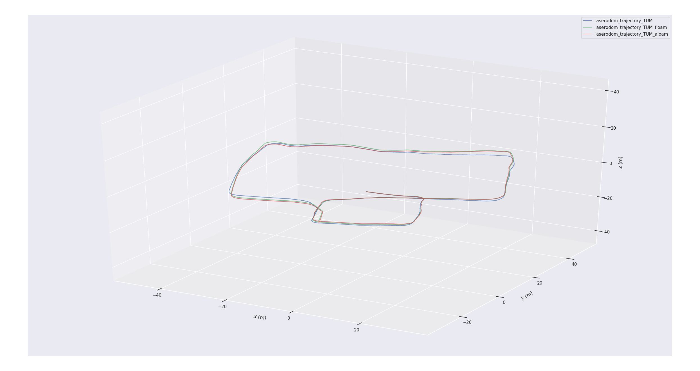
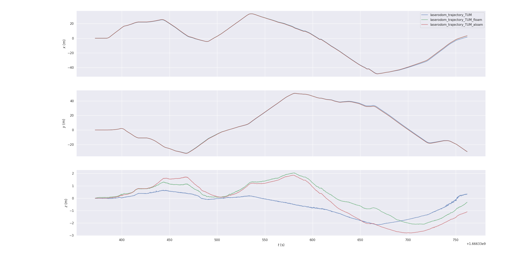
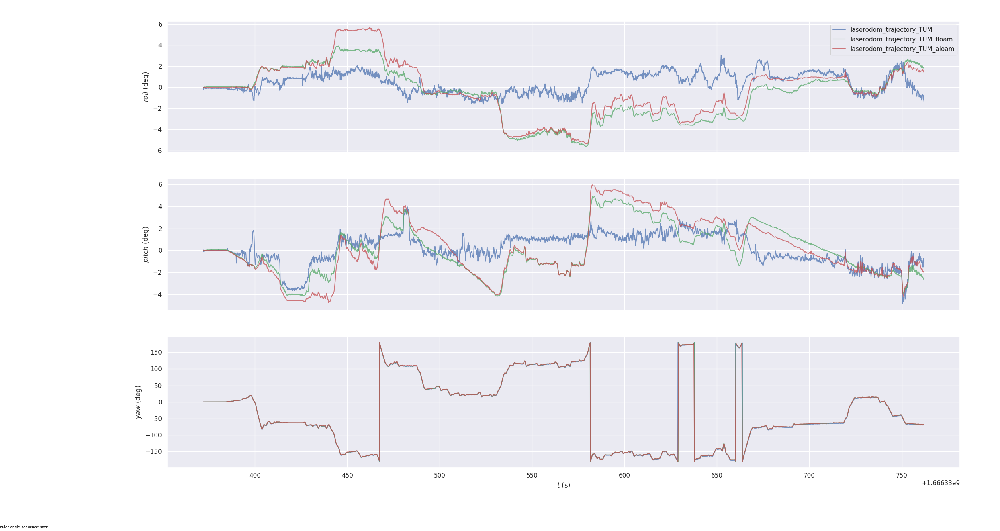
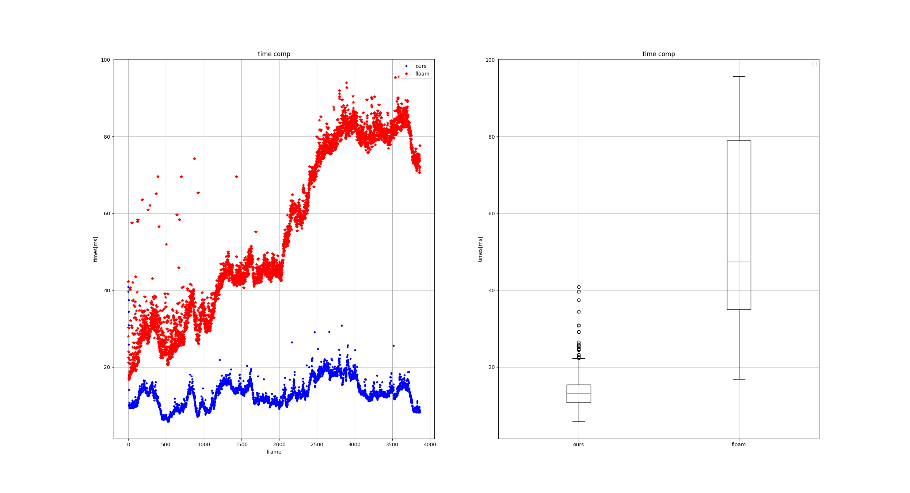

# fast-lo
fast-lo: Fast Laser Odom with new feature extract, truncated least squares and map manage.

# feature

  - Feature extract moudle is implemented based on w-loam and lio-sam
  - map manage is implemented base on ikd-tree
  - TLS is implemented base on tloam;

# demo
[**VIDEO-1: multi-storey garage**](https://www.bilibili.com/video/BV1b84y1k7VK/?spm_id_from=333.337.search-card.all.click&vd_source=438f630fe29bd5049b24c7f05b1bcaa3)

[**VIDEO-2: park**](https://www.bilibili.com/video/BV1Zv4y197gK/?spm_id_from=333.999.0.0&vd_source=438f630fe29bd5049b24c7f05b1bcaa3)

**[update 2022-12-07]**
trajectory comparison about aloam,floam and fast-lo

     

evo_ape result, left: fast-lo VS aloam   right: fast-lo VS floam(video1)

     
     

     
     

time compare: fast-lo VS floam

     

## TODO

  - [ ] change project name
  - [ ] add TLS

## Acknowledgments
Thanks for LOAM, FLOAM, [W-LOAM](https://github.com/Saki-Chen/W-LOAM),[tloam](https://github.com/zpw6106/tloam),[ikd-tree](https://github.com/hku-mars/ikd-Tree).
