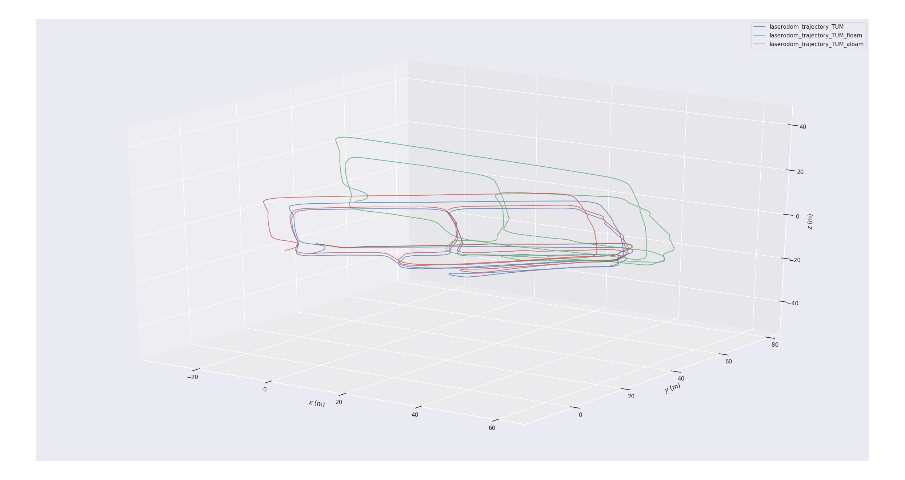
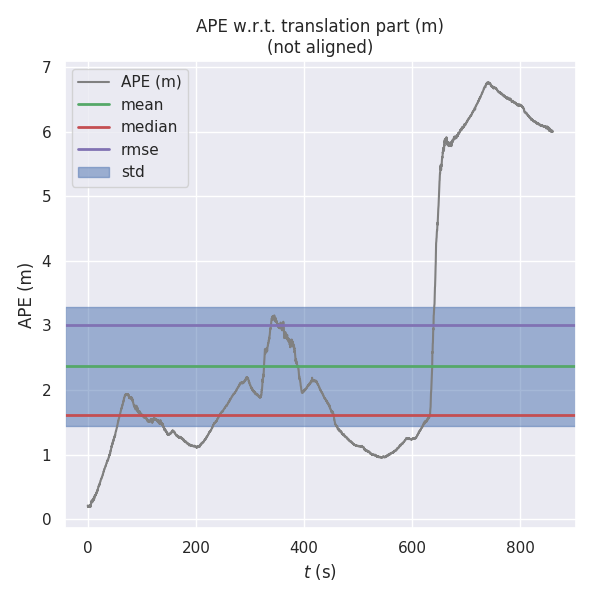
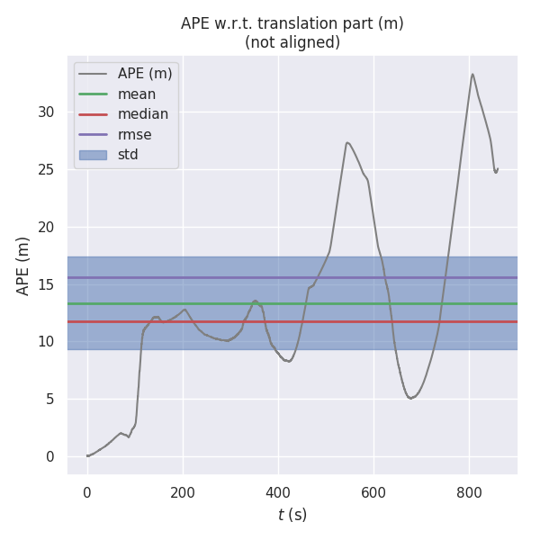
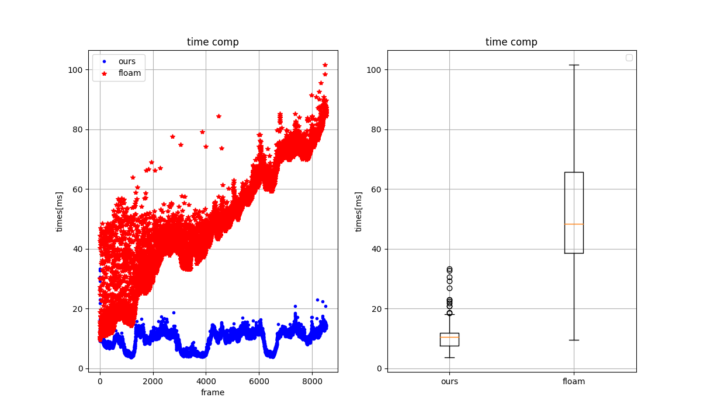

# fast-lo
Fast Laser Odom with new feature extract and map manage

# demo
[**VIDEO**](https://www.bilibili.com/video/BV1b84y1k7VK/?spm_id_from=333.337.search-card.all.click&vd_source=438f630fe29bd5049b24c7f05b1bcaa3)

**[update 2022-12-07]**
trajectory comparison about aloam,floam and fast-lo

     

evo_ape result, left: fast-lo VS aloam   right: fast-lo VS floam

     
     

time compare: fast-lo VS floam

     

